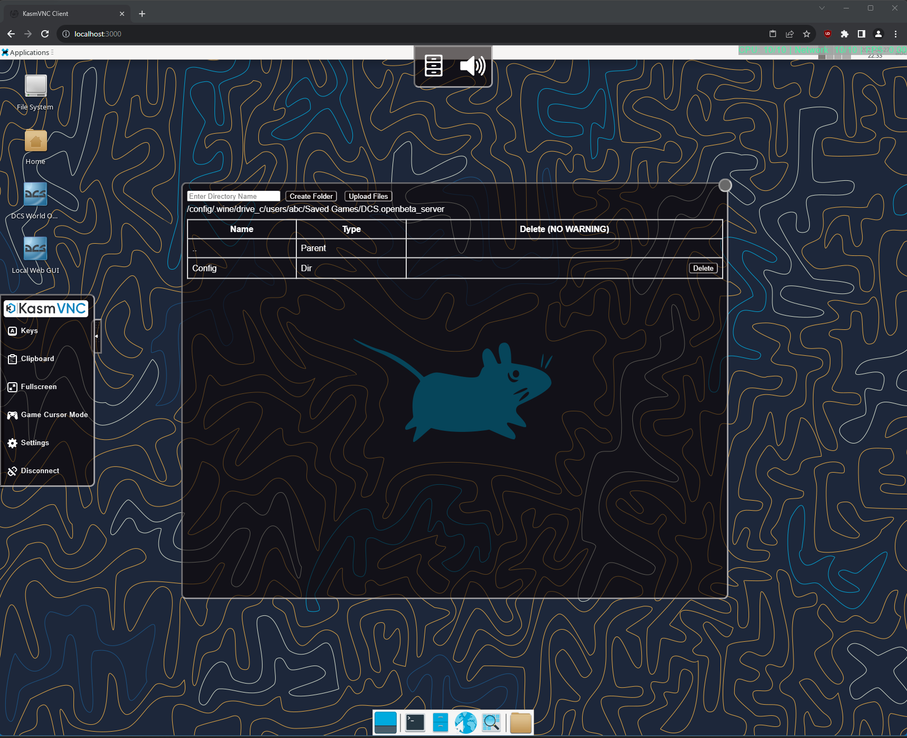

# DCS-World-Dedicated-Server-Docker

## **tl;dr?**

**Q:** What does this Docker image do? 

**A:** It lets you run the DCS Dedicated server on Linux (in a Docker container) with web based access to a GUI running the xfce desktop environment complete with auto installation (including chosen map modules), auto startup and auto updates.

## Longer summary

This repository provides a Docker image created in order to run the DCS World Dedicated server using WINE (relatively painlessly) and is based on the Alpine version of the [linuxserver/webtop image](https://docs.linuxserver.io/images/docker-webtop). 

Various automations and helper scripts are provided. In depth configuration and management of the server is best done via the provided WebGUI (that's mainly why this image is based on the [linuxserver/webtop image](https://docs.linuxserver.io/images/docker-webtop) image.)

## Table of Contents

- [Quickstart](#Quickstart)
- [Configuration](#Configuration)
- [Supported docker mods](#supported-docker-mods)
- [FAQ](#FAQ)
- [Troubleshooting](#Troubleshooting)
- [Contributing](#Contributing)
- [License](#License)

## Quickstart

### Prerequisites

* You are running a platform which supports Docker and you have Docker installed on your system. i.e. a Linux machine or cloud VM. You can download it from [here](https://www.docker.com/get-started).
* Ensure you have enough storage space to store the DCS server and your chosen terrains.
* You understand how and when to open ports and setup port forwarding to your running DCS server through your router, firewall and machine where this is required.
* You are already familiar with configuring and running a DCS Dedicated server (from Windows) as this project does not go into depth about how to do so.

### Using the DockerHub provided image

* First familiarise yourself with the [linuxserver/webtop image](https://docs.linuxserver.io/images/docker-webtop) image and consult their documentation on how to make use of the provided web accessible GUI functionality. Particularly how to secure access to the running container and adding SSL certificates where needed.
* Take a look at the [docker-compose/Dedicated-Server](docker-compose/Dedicated-Server/) folder and ``docker-compose.yml`` file. Make amendments as needed, taking care with the volume binds ensuring the chosen location has sufficient storage.
* Copy and amend ``.env.example `` to ``.env`` as required. If you want to validate the correct settings are applied you can run ``docker compose config`` to display what Docker will use.
* To start the container, navigate to the [docker-compose/Dedicated-Server](docker-compose/Dedicated-Server/) directory and then run the command ``docker compose up -d && docker logs -f dcs-world-dedicated-server``.
* On first start, (if ``DCSAUTOINSTALL=1``,) the container will download and install the WINE prerequisites and modular Dedicated DCS server executable then begin installation of the DCS Server and your chosen terrain modules. You can open the WebGUI at the default port ``3000`` or your chosen port to observe this process.
* If you wish to manually request installation, you can run the installer with the ``Run DCS Install`` desktop shortcut or by opening a terminal and running the command:
        
        /app/dcs_server/wine-dedicated-dcs-automated-installer/dcs-dedicated-server-automatic-installer.sh 

  * **Note:** Even if you request a manual installation, if you have set the environment variables ``DCSAUTOINSTALL=1`` and given a valid ``DCSMODULES`` list in your docker compose ``.env`` file, the installer will be fully automated from this point. If you have not elected to set the above, the installer will first install the base server and then prompt you to interactively choose the terrain modules to install. 
* Post server installation, various shortcuts will now also have been added to the desktop for opening the server WebGUI or running and updating the DCS server, installing or removing modules and opening DCS server related directories.
* Once you have configured your DCS Server installation to your taste, you can set it to auto start by defining the environment variable ``AUTOSTART=1``. Note: this will only function if you save login details and enable auto login on the DCS launcher.

### Using a self built image

* Navigate to the ``docker`` subdirectory and run the command ``docker build -t $USER/dcs-world-dedicated-server .``
* Take a note of the final line of this command's output e.g. :

        => => naming to docker.io/myusername/dcs-world-dedicated-server

* Amend the [docker-compose/Dedicated-Server/docker-compose.yml](docker-compose/Dedicated-Server/docker-compose.yml) image line to: 
  
        image: myusername/dcs-world-dedicated-server

* You can now follow the instructions as per the [Using the DockerHub provided image](#Using-the-DockerHub-provided-image) section.

## Example installation video

**Hint:** Click the image to go to Youtube.

## Configuration

### Common post installation configuration actions

After installation is complete, you can configure your server as you would do so typically, editing configuration or adding missions etc... at to the following path (which you can also open from the ``DCS Saved Games Dir`` desktop shortcut):

    "/config/.wine/drive_c/users/abc/Saved Games/DCS.server/"

**Hint:** you can open the DCS WebGUI in the browser by using the ``Open DCS Server WebGUI`` desktop shortcut.

**Hint:** you can set the DCS server to auto start by defining the environment variable ``AUTOSTART=1``. Note: this will only function if you save login details and enable auto login on the DCS launcher.

**Hint:** upload of files to the folder above can be done using the KASM menu's file manager as shown below.

### Installation / uninstallation of modules

**Important:** The base server installation must have finished before installation of modules!

To install or uninstall modules you can run the ``Run DCS Module Installer`` shortcut on the desktop to do so interactively or you can call the helper script directly in a terminal with the action (install or uninstall) and a list of modules e.g. installing the Mariana terrain:

    /app/dcs_server/wine-dedicated-dcs-automated-installer/dcs-dedicated-server-module-installer.sh install MARIANAISLANDS_terrain

Or uninstalling the Mariana terrain:

    /app/dcs_server/wine-dedicated-dcs-automated-installer/dcs-dedicated-server-module-installer.sh uninstall MARIANAISLANDS_terrain

The list should be supplied as a whitespace separated list of modules as per https://forum.dcs.world/topic/324040-eagle-dynamics-modular-dedicated-server-installer/

### Table of available container environment variables

The following environment variables can be configured to customize the behavior of the Docker container:

| Variable Name      | Default Docker Compose Value | Valid Values           | Description                                                                                                           |
|--------------------|------------------------------|------------------------|-----------------------------------------------------------------------------------------------------------------------|
| VNCPASSWORD        | `123123123`                  | Any string             | Set to the desired VNC password for accessing the containerized environment (e.g. `123123123`).                    |
| PUID               | `1000`                       | Numeric value          | Specifies the user ID for the container (e.g. `1000`).                                                               |
| PGID               | `1000`                       | Numeric value          | Specifies the group ID for the container (e.g. `1000`).                                                              |
| TZ                 | `Etc/UTC`                    | Timezone string        | Sets the timezone for the container (e.g., `Etc/UTC`).                                                                |
| DCSAUTOINSTALL     | `1`                          | `1` or `0`              | Controls automatic installation of the DCS server. Set to `1` for automatic installation, and `0` to disable auto-installation. |
| DCSMODULES         | `"MARIANAISLANDS_terrain"`   | Whitespace-separated list | Specifies DCS modules to be installed. Refer to [Eagle Dynamics Modular Dedicated Server Installer](https://forum.dcs.world/topic/324040-eagle-dynamics-modular-dedicated-server-installer/) for module names. Example: `MARIANAISLANDS_terrain`. |
| FORCEREINSTALL     | `0`                          | `1` or `0`              | Controls whether the installer will forcefully remove existing installations during (re)installation of the DCS server. Set to `1` for forceful reinstall, and `0` to disable forceful reinstall. |
| AUTOSTART          | `0`                          | `1` or `0`              | Controls whether the DCS Server will automatically start. Set to `1` for automatic startup, and `0` to disable automatic startup. |
| TIMEOUT            | `60`                         | Numeric value (whole number) | Specifies the interval in seconds between various "liveness" checks (e.g. `60` seconds).                               |
| ENABLE_DCS_RETRIBUTION          | `0`                          | `1` or `0`              | Controls whether the DCS Retribution will automatically install / update. Set to `1` to enable, and `0` to disable. Note: the docker mod must be added as detailed below in the "Supported docker mods" section for this to function. |

Further valid environment variables for the image this project is built on can be found at the [linuxserver/webtop image](https://docs.linuxserver.io/images/docker-webtop) documentation page.

## Supported docker mods

This image is planned to support extended functionality and modifications using the LinuxServer.io [docker mods](https://github.com/linuxserver/docker-mods) mechanism.

The currently supported DockerMods will be listed below.

### DCS Retribution

[DCS Retribution](https://github.com/dcs-retribution/dcs-retribution) was forked from DCS Liberation, which is a DCS World turn based single-player or co-op dynamic campaign. It is an external program that generates full and complex DCS missions and manage a persistent combat environment. When enabled, a desktop shortcut is added and it can be used inside the container.

To use this docker mod, two variables must be added to your docker compose file:

    - ENABLE_DCS_RETRIBUTION=${ENABLE_DCS_RETRIBUTION:-0}
    - DOCKER_MODS=aterfax/dcs-world-dedicated-server-mod-retribution:latest

And you must set the ``ENABLE_DCS_RETRIBUTION=1`` in your ``.env`` file.

Please note, that using DCS Retribution requires that several higher risk methods are made available to make persistence between missions work. These methods can then be invoked by any script that your missions run. This means 
that an attacker could use a mission file to execute arbitrary code on your server, read or write arbitrary data, erase your server etc... Please take care to only run missions from trusted sources.

An example compose file is also provided: [docker-compose/Dedicated-Server-DockerMod-Retribution](docker-compose/Dedicated-Server-DockerMod-Retribution/).

The Dockerfile for this mod can be found at:  [docker/Dockerfile.DockerMod.dcs-retribution](docker/Dockerfile.DockerMod.dcs-retribution)

### DCSServerbot

[DCSServerBot](https://github.com/Special-K-s-Flightsim-Bots/DCSServerBot) is a Discord bot which lets you administrate your DCS server instances via Discord slash-commands.
It has built in per-server and per-user statistics, optional cloud-based statistics, Coalitions-support and much more! With its plugin system and reporting framework, DCSServerBot 
can be enhanced very easily to support whatever might come into your mind. DCSServerBot is a solution for DCS server admins built by a DCS server admin.

This docker mod enables automatic installation and update of the DCSServerBot files within the container as well as automatic start up. The server administrator will still need to follow
the installation instructions provided within the DCSServerBot README to establish the correct setup with Discord and the DCS server within the container: 
https://github.com/Special-K-s-Flightsim-Bots/DCSServerBot?tab=readme-ov-file#installation

**Please read these instructions wholly and carefully before attempting to use this Docker mod.**

To use this docker mod, three variables must be added to your docker compose file (set in the [example docker-compose file](docker-compose/Dedicated-Server-DockerMod-dcsserverbot/docker-compose.yml)):

    - DCSSBAUTOINSTALL=${DCSSBAUTOINSTALL:-0}
    - DCSSBAUTOSTART=${DCSSBAUTOSTART:-0}
    - DOCKER_MODS=aterfax/dcs-world-dedicated-server-mod-dcsserverbot:latest

With the configurable values provided in your ``.env`` file as:

    - DCSSBAUTOINSTALL=1
    - DCSSBAUTOSTART=0

The DCSServerBot setup steps can then be started manually with the "Setup DCSServerBot" shortcut from the desktop. Follow the on screen instructions 
and supply the details required.

After setup and installation is complete, ``DCSSBAUTOSTART=1`` can be set to enable the autostart.

The "Run DCSServerBot" shortcut can then be used to start DCSServerBot, or used if you have the autostart disabled.

As DCSServerBot requires a PostgreSQL database the provided [example docker-compose file](docker-compose/Dedicated-Server-DockerMod-dcsserverbot/docker-compose.yml) also 
stands up sidecar [postgres](https://hub.docker.com/_/postgres) and [Adminer (formerly phpMyAdmin)](https://hub.docker.com/_/adminer/) containers which can be accessed 
via their hostnames, ``postgres`` and ``adminer``.

If using the provided example ``.env`` and docker-compose file, please amend the ``POSTGRES_PASSWORD`` to something sensible and during the DCSServerBot installation process, you 
would use ``postgres`` as the hostname and ``DCSServerBot`` as the username and database name.

As DCSServerbot handles automatic start of the DCS Server as part of its functionality, you should disable the container's identical functionality by
amending the ``AUTOSTART`` environment variable to ``AUTOSTART=0`` in your chosen ``.env`` file.

The native container autoupdate functionality does not interfere with the same functionality from DCSServerbot.

If you encounter an error when starting DCSServerBot that Python.exe is not found on the $PATH, please try repairing or removing and reinstalling Python
manually via the executable provided in ``/config/``. You can do so by opening a terminal and running ``wine /config/python-3.11.6-amd64.exe``.

If you need to clean up and reinstall the Python environment (venv) that DCSServerBot uses (e.g. if DCSServerbot fails to start), you can open 
the "DCSServerbot Dir" shortcut, right click to start a terminal then run the command ``wine cleanup.cmd``. When this finishes, 
you can run ``wine install.cmd``.

The Dockerfile for this mod can be found at:  [docker/Dockerfile.DockerMod.dcsserverbot](docker/Dockerfile.DockerMod.dcsserverbot)

## FAQ

### Which user am I within the container?

As with most linuxserver.io images, in this container you will run things as the ``abc`` user. Note that the ``abc`` user's UID and GID will be those you specified within the ``docker-compose.yml`` file.

### How do I change the ports or pass through more ports from the container?

To change the ports passed through or add more, you need to edit the ports section in the ``docker-compose.yml`` file. The ports section defines the mapping between the ports on the host machine and the ports inside the container.

The syntax for the ports section is:

        ports:
        - <host_port>:<container_port>

Once you have edited the ports section, you need to rebuild and restart the containers using the ``docker-compose up -d`` command.

Keep in mind when changing the port or passing through new ports:

- If you are changing the port for the server you also need to update the firewall rules on your host machine / firewalls to allow traffic on the changed / new port as well as amending any port forwarding rules as needed.

- Changing the ports for the Docker container will not change the ports any running DCS Server is using! You need to also change the DCS Server configuration and match the passed through ports if you use ports not already specified in the ``docker-compose.yml``.

### "Failed to fdwalk: Operation not permitted" errors

Setting seccomp to unconfined with security_opt is necessary if you encounter ``Failed to execute child process "bash": Failed to fdwalk: Operation not permitted`` errors.

The example ``docker-compose.yml`` files include a commented out section to to this which you can uncomment. See also: https://docs.linuxserver.io/images/docker-webtop/#application-setup

## Troubleshooting

If you encounter issues, check the [Troubleshooting section](TROUBLESHOOTING.md)  for solutions to common problems.

If this section is lacking steps to resolve your issue please take a look in the Github discussions to see if someone else has already resolved your issue or 
please start a thread.

If you have a problem or feature request and you know this related directly to the code implemented by this repo please file an issue detailing the nature of the problem or feature and any steps for implementation within a pull request.

## Contributing

If you'd like to contribute to this project, follow these steps:

* Fork the repository.
* Create a new branch for your feature: git checkout -b feature-name.
* Make your changes and commit them e.g. : git commit -m "Add feature".
* Push to the branch: git push origin feature-name.
* Create a pull request explaining your changes.

## License

This project is licensed under the [GNU General Public License v3 (GPL-3)](https://www.tldrlegal.com/license/gnu-general-public-license-v3-gpl-3).

In short: You may copy, distribute and modify the software as long as you track changes/dates in source files. Any modifications to or software including (via compiler) GPL-licensed code must also be made available under the GPL along with build & install instructions.
